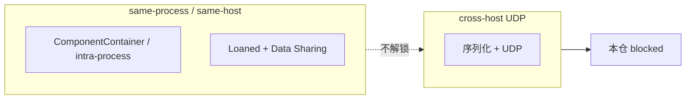

# 中日公开 ROS 2 / DDS 优化吸收（对照本仓双链）

Status: **文档对照 — 不落地旋钮。**  
查阅日期：2026-09-12。只写能核对到公开 URL 的内容；核不到的标 **未核实**，不编造数字。

三条「吸收」只进**本文**：奥比中光 Fast DDS 大缓冲、Autoware Cyclone 10MB recv window、Loaned Messages + Fast DDS Data Sharing。它们的数字与旋钮**不写进** [`config/fastdds.xml`](../../config/fastdds.xml)、SCOREBOARD 已记账表、SCOREBOARD current best、或任何现网 / 默认 XML。本仓不另写 Cyclone 示例文件。

| 允许 | 禁止（本 PR） |
|------|----------------|
| 本文 + README 一条指针 | 改 [`config/fastdds.xml`](../../config/fastdds.xml)（iter7 种子不动） |
| CI 检查本文存在 | 改 SCOREBOARD 已记账表 / current best |
| | 任何现网 / 默认 XML 写入新旋钮值 |
| | vendor Autoware / Agnocast / Isaac / zenoh / iceoryx |
| | 新增 RMW、rebase 发行版 |
| | Promptfoo / Mac 占位测 / CVE（《3》–《6》仍 **Hold**） |

**不是** 飞书现场 / 实机 / 跨机根因证明。Not Feishu field proof.

本仓契约仍是两条独立栈：[R0 接口冻结](ros2-dds-r0-interface-freeze.md)。链 A Fast-DDS 域 **42**，链 B Cyclone 域 **0**。DimOS 默认传输仍是 **LCM**（Linux）。NITROS 仍是同进程 GPU：[nitros-vs-dual-chain.md](nitros-vs-dual-chain.md)。跨机 UDP 仍 **blocked**（单机 yixin Docker DOWN）。

---

## 0. 拓扑先分清（零拷不是跨机解锁）

| 路径 | 是什么 | 不是什么 |
|------|--------|----------|
| **同进程 / 同机** 零拷 | ComponentContainer / intra-process；以及 Loaned Messages + Fast DDS Data Sharing（`rmw_fastrtps` 写明加速 **intra-host**） | **不是** 跨机 UDP 解锁 |
| **跨机 UDP** | 普通 RMW/DDS 序列化走网卡（`rmw_fastrtps` 默认 inter-host 用 UDPv4） | 本仓仍 **STATUS: blocked**（yixin Docker DOWN / 单 VM）。无假分位数 |

本 PR **不**在现网 XML 翻转 `data_sharing`。

---

## 1. 对照到本仓双链

| 公开项 | 本仓落点 | 本 PR 动作 |
|--------|----------|------------|
| TIER IV / Autoware Agnocast（未定长真零拷；kmod + `LD_PRELOAD` heaphook；`ENABLE_AGNOCAST`） | **不是** 第三条链，也不是 RMW。跨机 / rviz / rosbag 仍走现有 RMW/DDS | **Hold**：不 vendor、不装 kmod |
| Autoware / Cyclone recv window（见 TIER IV 页 + 其 ROS 2 DDS tuning） | 链 B 默认 **不** 设 `CYCLONEDDS_URI` | **只引 URL，example only**；不写 XML |
| Autoware 经典 ComponentContainer 同进程 | 同进程少拷；故障隔离 vs 零拷 | 只对照 |
| 奥比中光 Fast DDS 大缓冲（example `1048576`） | 链 A 现网仍是 iter7 种子 | **只引 URL，example only**；不改 XML |
| Loaned + Data Sharing | **same-process / same-host** 零拷 | **只对照**；**不**解锁跨机 UDP；不翻转现网 `data_sharing` |
| openEuler 24.03：Jazzy + `rmw_zenoh` 预览；Embedded Humble / SDK | 本仓 Humble + 双链 RMW；`ZenohTransport` 仍是空 stub | **Hold** 新 RMW 与 rebase |

---

## 2. 日本

### 2.1 Agnocast（TIER IV / Autoware）— Hold

公开博客：[Agnocast: A True Zero-Copy Publish/Subscribe IPC](https://autoware.org/agnocast-a-true-zero-copy-publish-subscribe-ipc/)（2025-09-24）。仓库：[tier4/agnocast](https://github.com/tier4/agnocast)（README 现指向 [autowarefoundation/agnocast](https://github.com/autowarefoundation/agnocast) 与 [Getting Started](https://autowarefoundation.github.io/agnocast_doc/environment-setup/)）。

已核实要点：

- Autoware 作为 ROS 2 应用，跨进程 pub/sub 会做多次拷贝（含序列化 / 反序列化）。他们曾用 **ComponentContainer 把节点放进同一进程** 来避开这份开销。从故障隔离看，更希望每节点独立进程，因此需要「对任意 ROS 2 消息（含 `std::vector` 等未定长类型）的真零拷 IPC」。
- Iceoryx / Iceoryx2 等生产级中间件支持真零拷，但**只覆盖静态尺寸消息**，Autoware 大量未定长类型用不了。TZC / LOT 也不是任意 ROS 2 消息。
- Agnocast：内核模块（`agnocast-kmod`，`sudo modprobe agnocast`）+ `LD_PRELOAD` heaphook（`agnocast-heaphook`）把堆分配拦到可跨进程映射的共享虚址；智能指针元数据在 kmod 里。博客写明与 ROS 2 栈**共存**，且「不受 RMW 实现变更影响」——它**不是**一个新 RMW。
- 源码侧还要改智能指针 / pub/sub 命名空间（`rclcpp` → `agnocast`）以及 launch（`LD_PRELOAD`、ComposableNode 用 Agnocast executor）。
- Autoware 集成用构建期环境变量 **`ENABLE_AGNOCAST`** 开关（博客指向 `autoware_agnocast_wrapper`）。wrapper 说明：未设或 `0` = 普通 ROS 2；`1` = Agnocast 构建。[review guide](https://github.com/autowarefoundation/autoware_core/blob/a50ac9281442b83ec240aedcb4fe78598e07c8e3/common/autoware_agnocast_wrapper/docs/review_guide.md)
- TIER IV 在 Open Robotics Discourse 写明：即使 Agnocast 构建，**跨主机通信以及依赖 RMW 的 rviz / rosbag 仍走现有 RMW 栈**；与非 Agnocast 节点靠 Bridge。[Discourse #52678](https://discourse.openrobotics.org/t/agnocast-callback-isolated-executor-true-zero-copy-ipc-and-middleware-transparent-scheduling-for-ros-2/52678)

**本仓 verdict: Hold。** 不 vendor Agnocast 树，不装 / 不加载 kmod，不加第三条链。跨机 UDP、域 42/0、Fast-DDS XML 旋钮都不在 Agnocast 覆盖范围。

### 2.2 Autoware / Cyclone recv window — 只引原文，example only

来源（Researcher 指定；**不要**抄进本仓 XML / SCOREBOARD）：

- TIER IV Autoware：[Additional settings for developers](https://tier4.github.io/autoware-documentation/latest/installation/additional-settings-for-developers/)（「DDS settings」节：CycloneDDS 默认；recv buffer 对点云 / 图像关键；示例 `CYCLONEDDS_URI` + 示例 XML 含 `SocketReceiveBufferSize min="10MB"`）。
- 该页指向的 ROS 2 DDS tuning：[Humble DDS-tuning](https://docs.ros.org/en/humble/How-To-Guides/DDS-tuning.html)。更早的 ROS 2 副本把同一 10MB recv window 写成 `MinimumSocketReceiveBufferSize` 10MB（例：[Foxy](https://docs.ros.org/en/foxy/How-To-Guides/DDS-tuning.html)）。

**Cite as example only。** 不写入 `config/fastdds.xml`、SCOREBOARD、或任何现网 / 默认 Cyclone XML。链 B 默认仍 **不** 设 `CYCLONEDDS_URI`。

### 2.3 ComponentContainer 同进程 — 对照，不落地

同一篇 Agnocast 博客：Autoware 经典做法是 **ComponentContainer 同进程**，避免跨进程序列化/拷贝；Agnocast 存在，是因为他们要 **进程隔离 + 真零拷**。

**同进程零拷 = ComponentContainer / intra-process**，不是 Data Sharing，也不是跨机 UDP。这与本仓 [NITROS 对照](nitros-vs-dual-chain.md) 同一类权衡。same-process bench 只作诚实对照，**不要为它调参**。

---

## 3. 中国大陆

### 3.1 奥比中光 Fast DDS 大缓冲 — 只引原文，example only

来源（Researcher 指定）：[Fast DDS Optimization for Orbbec Camera with ROS2](https://orbbec.github.io/OrbbecSDK_ROS2/en/source/camera_devices/5_advanced_guide/performance/fastdds_tuning.html)。

已核实：该页 `shm_fastdds.xml` **示例**里 `sendBufferSize` / `receiveBufferSize` 以及 `listenSocketBufferSize`（同文件还有 `sendSocketBufferSize`）= **1048576**。环境变量示例为 `RMW_IMPLEMENTATION=rmw_fastrtps_cpp`、`FASTRTPS_DEFAULT_PROFILES_FILE`、`RMW_FASTRTPS_USE_QOS_FROM_XML=1`。

**Cite as example only。** 不把 1048576 或他们的 `useBuiltinTransports` false 写进 [`config/fastdds.xml`](../../config/fastdds.xml) 或 SCOREBOARD。链 A 现网仍是 iter7 种子。

### 3.2 Loaned Messages + Data Sharing — same-process / same-host，不解锁跨机

来源（Researcher 指定）：

- ROS 2 Jazzy：[Configure Zero Copy Loaned Messages](https://docs.ros.org/en/jazzy/How-To-Guides/Configure-ZeroCopy-loaned-messages.html)（页标题 / og 描述已核实为 loaned messages + zero copy data sharing；正文本次抓取被 Anubis 拦下，主张以该 URL 与下一份 README 为准）。
- `rmw_fastrtps`：[Enable Zero Copy Data Sharing](https://github.com/ros2/rmw_fastrtps#enable-zero-copy-data-sharing)（本仓拷贝 [`vendor/rmw_fastrtps/README.md`](../../vendor/rmw_fastrtps/README.md) 一致）。

已核实（README）：Loaned Messages + Fast DDS Data Sharing 用来加速 **intra-host**；默认 `rmw_fastrtps_cpp` 用 Shared Memory 做 intra-host、**UDPv4 做 inter-host**。Humble 上 Loaned Messages 还要 POD + 打开 Data Sharing（`RMW_FASTRTPS_USE_QOS_FROM_XML=1` + XML `data_sharing` AUTOMATIC）。

因此：

- **same-process / same-host 零拷**。不是跨机 UDP 解锁。
- 本仓跨机 UDP 仍 **blocked**（yixin Docker DOWN）。
- **本 PR 不**在 [`config/fastdds.xml`](../../config/fastdds.xml) 加或翻转 `data_sharing`。SCOREBOARD 不抄这些旋钮。

### 3.3 openEuler 24.03 / Embedded — Hold 新 RMW 与 rebase

来源：

- [openEuler 社区 2025 年 3 月运作报告](https://www.openeuler.org/zh/news/openEuler/20250407-yb/20250407-yb.html)：openEuler **24.03 LTS** 引入 **ROS 2 Jazzy**（Turtlesim / rqt / 全套 CLI；移植工具 ROT）。文内写 Jazzy「首次引入 **rmw_zenoh 中间件预览版**」。
- [openEuler Embedded 24.03 — 嵌入式 ROS 运行时支持](https://embedded.pages.openeuler.org/openEuler-24.03-LTS/features/ros.html)：ROS2 镜像 / **快速开发 SDK**（`populate_sdk` + colcon 交叉编译）。同页写明「当前 src-openeuler 已集成 **ROS humble** 的所有软件源码」。

**本仓 verdict: Hold。** 不引入 `rmw_zenoh`（DimOS `ZenohTransport` 仍是空 stub）。不把发行版从 Humble rebase 到 Jazzy。Embedded SDK 只作公开存在证明，不 vendor、不改 Docker 配方。

---

## 4. 对本仓契约的明确「不是」

| 项 | 状态 |
|----|------|
| 链 A：`rmw_fastrtps_cpp` / 域 42 / `config/fastdds.xml` iter7 种子 | **不变** |
| 链 B：Cyclone / 域 0；默认不设 `CYCLONEDDS_URI` | **不变**；Autoware / ROS 2 DDS tuning 只引 URL |
| DimOS 默认 LCM | **不变**，仍在 DDS 范围外 |
| NITROS | 仍同进程 GPU only，见 [nitros-vs-dual-chain.md](nitros-vs-dual-chain.md) |
| Loaned + Data Sharing | **same-process / same-host**；**不是**跨机 UDP |
| 同进程少拷（组合） | ComponentContainer / intra-process |
| 跨机 UDP | 仍 **STATUS: blocked**（yixin Docker DOWN / 单 VM）；无假分位数 |
| 现网 `data_sharing` | **不翻转** |
| 《3》90%/LLM、《4》Mac/preprod、《5》Promptfoo、《6》CVE | 仍 **Hold** |
| 飞书现场 / 实机根因 | **不是。** Not Feishu field proof. |

---

## 5. 公开引用

三条吸收的 Researcher 指定 URL（2026-09-12 核对；数字只作 example，不写进现网 / SCOREBOARD）：

1. Orbbec — *Fast DDS Optimization for Orbbec Camera with ROS2*（example `sendBufferSize` / `receiveBufferSize` / `listenSocketBufferSize` = 1048576）：<https://orbbec.github.io/OrbbecSDK_ROS2/en/source/camera_devices/5_advanced_guide/performance/fastdds_tuning.html>
2. TIER IV Autoware — *Additional settings for developers*（Cyclone recv window）：<https://tier4.github.io/autoware-documentation/latest/installation/additional-settings-for-developers/>
3. 该页指向的 ROS 2 DDS tuning（Humble）：<https://docs.ros.org/en/humble/How-To-Guides/DDS-tuning.html>  
   更早副本把 10MB recv 写成 `MinimumSocketReceiveBufferSize`：<https://docs.ros.org/en/foxy/How-To-Guides/DDS-tuning.html>
4. ROS 2 Jazzy — *Configure Zero Copy Loaned Messages*：<https://docs.ros.org/en/jazzy/How-To-Guides/Configure-ZeroCopy-loaned-messages.html>
5. `ros2/rmw_fastrtps` — *Enable Zero Copy Data Sharing*（intra-host；inter-host 仍 UDPv4）：<https://github.com/ros2/rmw_fastrtps#enable-zero-copy-data-sharing>

Hold / 背景（非落地）：

6. Autoware — *Agnocast*：<https://autoware.org/agnocast-a-true-zero-copy-publish-subscribe-ipc/>
7. GitHub `tier4/agnocast`：<https://github.com/tier4/agnocast>
8. Open Robotics Discourse #52678：<https://discourse.openrobotics.org/t/agnocast-callback-isolated-executor-true-zero-copy-ipc-and-middleware-transparent-scheduling-for-ros-2/52678>
9. `ENABLE_AGNOCAST` review guide：<https://github.com/autowarefoundation/autoware_core/blob/a50ac9281442b83ec240aedcb4fe78598e07c8e3/common/autoware_agnocast_wrapper/docs/review_guide.md>
10. openEuler 2025-03 月报（Jazzy + `rmw_zenoh` 预览）：<https://www.openeuler.org/zh/news/openEuler/20250407-yb/20250407-yb.html>
11. openEuler Embedded 24.03 — 嵌入式 ROS：<https://embedded.pages.openeuler.org/openEuler-24.03-LTS/features/ros.html>
12. 本仓双链：[ros2-dds-r0-interface-freeze.md](ros2-dds-r0-interface-freeze.md) · [nitros-vs-dual-chain.md](nitros-vs-dual-chain.md)

---

## 6. 2026-09 增补调研（中日 ROS 2 / DDS 公开成果）

查阅日期：2026-09-19。沿用原节约束——**只进本文，不写 `config/fastdds.xml`、不写 SCOREBOARD、不 vendor 第三方 DDS 源码树、不启用 zenoh/Agnocast、不加第三条链**。每条吸收方式限定在 `docs` / `config 文档` / `wrapper` / `scripts` / `bench 脚本` 五类之一。跨机 UDP 仍 blocked。

### 6.1 SIM：面向 AV 的无锁双缓冲共享内存框架（Autoware 实证）

- 来源：*A Faster and More Reliable Middleware for Autonomous Driving Systems*，arXiv:2510.11448（2025-10）：<https://arxiv.org/html/2510.11448>
- 优化点：用 domain-specific、lock-free、double-buffered 的 SHM 替换 Fast DDS（ZC）/ Zenoh 的 intra-host 传输，Autoware localization 路径 NDT 输出频率从 7.5 Hz 提到 9.5 Hz（上限 10 Hz），E2E 均值/尾部显著下降。
- 本仓吸收方式：`docs`——在本文加一段「SIM ≠ 本仓第三链」对照，并在 bench 脚本注释里登记为对照基线（`scripts/` 下只写说明性 wrapper，不接运行时）。
- 风险与 Hold 冲突：SIM 是**独立于 RMW 的 SHM 框架**，不是 RMW；vendor 它等于加第三条传输链，违反「不加第三链 / 不 vendor 第三方 DDS 源码树」。仅作文献对照。

### 6.2 Agnocast 论文版：未定长消息真零拷（iceoryx 静态尺寸限制）

- 来源：*ROS 2 Agnocast: Supporting Unsized Message Types for True Zero-Copy Pub/Sub IPC*，arXiv:2506.16882：<https://arxiv.org/html/2506.16882v1/>
- 优化点：论证 iceoryx 只覆盖静态尺寸消息、未定长类型仍有透明序列化代价；Agnocast 用 kmod + heaphook 解决任意 ROS 2 消息的真零拷。
- 本仓吸收方式：`docs`——把 §2.1 的博客结论升级为带论文引用的对照段，明确 iceoryx 静态尺寸边界。
- 风险与 Hold 冲突：kmod / `LD_PRELOAD` heaphook / 第三条传输——**Hold**，与原节一致，不加载模块。

### 6.3 ipc_shared_ptr：发布/订阅感知的跨进程智能指针（东京大学 + 埼玉大学 + TIER IV）

- 来源：*ipc_shared_ptr: A Publish/Subscribe-Aware Smart Pointer for Cross-Process Object Lifetime Management*，arXiv:2605.04226（东京大学 / 埼玉大学 / TIER IV）：<https://arxiv.org/html/2605.04226>
- 优化点：以 Autoware v1.7.1（223 节点 / 227 话题）为规模基线，single-writer 设计在 200 话题×2 订阅者×100 Hz 下 E2E p99.9 比 iceoryx2 低 2.9×。
- 本仓吸收方式：`docs`——作为「Autoware 规模画像 + 单写者可扩展性」的引用登记，供本仓 executor / WaitSet 对照（见 [feishu-executor-waitset.md](feishu-executor-waitset.md)）。
- 风险与 Hold 冲突：需改 `rclcpp` 智能指针 / 命名空间，等于改 vendor `rclcpp`——**Hold**（Humble `rclcpp` 不在 vendor 内，见 feishu-runtime-provenance）。

### 6.4 无线大载荷 DDS XML 调参框架（IP 分片 / 重传时机 / 缓冲突发）

- 来源：*Optimizing ROS 2 Communication for Wireless Robotic Systems*，arXiv:2508.11366（2025-08）：<https://arxiv.org/pdf/2508.11366> · HTML：<https://arxiv.org/html/2508.11366v1>
- 优化点：不改传输模式、只用各 DDS 厂商 XML profile 调三类参数——抑制 IP 分片、调整重传时机、削缓冲突发。
- 本仓吸收方式：`config 文档` + `scripts`——在 docs 里登记「无线大载荷 XML 旋钮示例（example only）」，并在 `scripts/` 下加一个**只读打印**的示例清单脚本（不写 `config/fastdds.xml`）。
- 风险与 Hold 冲突：直接写旋钮到现网 XML 违反 Hold；跨机 UDP 仍 blocked，本项只作 example。

### 6.5 DDS 心跳/重传的概率时延分析（无线场景）

- 来源：*Probabilistic Latency Analysis of the Data Distribution Service in ROS 2*，arXiv:2508.10413：<https://arxiv.org/pdf/2508.10413v1>
- 优化点：量化心跳周期、IP 分片与重传间隔三者耦合对端到端时延尾部的影响。
- 本仓吸收方式：`docs`——补充到 §0「跨机 UDP 仍 blocked」的旁证，说明为何本仓不冒然给跨机写分位数。
- 风险与 Hold 冲突：无新增落地；纯文献。

### 6.6 Fast DDS LARGE_DATA 模式（UDP 仅用于 PDP 发现）

- 来源：eProsima Fast DDS 文档 *Large Data Mode*：<https://fast-dds.docs.eprosima.com/en/latest/fastdds/use_cases/tcp/tcp_with_multicast_discovery.html> · Troubleshooting：<https://fast-dds.docs.eprosima.com/en/latest/fastdds/troubleshooting/troubleshooting.html> · Vulcanexus 教程：<https://docs.vulcanexus.org/en/jazzy/rst/tutorials/core/wifi/large_data/large_data.html>
- 优化点：`FASTDDS_BUILTIN_TRANSPORTS=LARGE_DATA` 让 UDP 只跑 PDP 发现，其余走 TCP/SHM，规避 UDP 大载荷丢包。
- 本仓吸收方式：`wrapper` 文档——在 `config/env/load.py` 旁边的说明里登记该环境变量为 **example only**（不 export、不写 XML）。
- 风险与 Hold 冲突：该模式是 eProsima 私有扩展，与标准 UDP 节点不互操作；不设为默认，不改 `config/fastdds.xml`。

### 6.7 Fast DDS 共享内存段（segmentId / 每 Participant 一段）语义

- 来源：Fast DDS *Shared Memory Transport*：<https://fast-dds.docs.eprosima.com/en/3.x/fastdds/transport/shared_memory/shared_memory.html>
- 优化点：每个开启 SHM 的 DomainParticipant 建一段 SHM，用 16 字符 UUID `segmentId` 标识，远端 Participant 直接映射读取。
- 本仓吸收方式：`docs`——补充 §3.2「Loaned + Data Sharing 是 intra-host」的底层语义说明。
- 风险与 Hold 冲突：无；仅文档。本仓不翻转 `data_sharing`。

### 6.8 Cyclone / iceoryx 内存池定长 segment 配置

- 来源：Eclipse Cyclone DDS *Shared memory configuration*：<https://cyclonedds.io/docs/cyclonedds/latest/shared_memory/shared_mem_config.html> · *Shared Memory*（0.10.5）：<https://cyclonedds.io/docs/cyclonedds/0.10.5/shared_memory.html>
- 优化点：iceoryx 内存池由若干定长 `size/count` segment 组成（如 512/1024/4096/1MB），按消息尺寸分布调 mempool 可显著提升 SHM 命中。
- 本仓吸收方式：`config 文档`——在 docs 里登记「Cyclone SHM mempool 示例尺寸表（example only）」，链 B 默认仍不设 `CYCLONEDDS_URI`。
- 风险与 Hold 冲突：不写 Cyclone XML、不设 `CYCLONEDDS_URI`；与 §2.2 同口径。

### 6.9 Cyclone SHM 的 QoS 前置条件

- 来源：Cyclone DDS *Limitations of shared memory*：<https://cyclonedds.io/docs/cyclonedds/latest/shared_memory/limitations.html>
- 优化点：走 iceoryx SHM 的 Writer 必须 `Liveliness=AUTOMATIC`、`Deadline=INFINITY` 等，否则 SHM 不生效。
- 本仓吸收方式：`docs`——作为链 B 若将来启用 SHM 时的 QoS 对照表。
- 风险与 Hold 冲突：当前链 B 不启用 SHM，仅备查。

### 6.10 iceoryx2 v0.6.0（Rust，自包含 / 统一内存表示）

- 来源：Eclipse Newsroom *Announcing iceoryx2 v0.6.0*（2025-05）：<https://newsroom.eclipse.org/news/community-news/announcing-iceoryx2-v060>
- 优化点：数据须 self-contained、内存表示统一才能 loan 未初始化样本进 SHM，官方基准 E2E 延迟可到 ~100 ns 量级且与 payload 大小基本无关。
- 本仓吸收方式：`docs`——登记 iceoryx2 与 Cyclone/rmw 的关系（Cyclone 仍走 iceoryx1 RouDi；iceoryx2 尚未在本仓 vendor 内）。
- 风险与 Hold 冲突：不 vendor、不接 `rmw_iceoryx2`；与 §3.3「Hold 新 RMW」一致。

### 6.11 iRobot ROS 2 性能基准套件（容器化 RMW 对比）

- 来源：Open Robotics Discourse #51921 *iRobot's ROS benchmarking suite now available!*（2026-01）：<https://discourse.openrobotics.org/t/irobots-ros-benchmarking-suite-now-available/51921> · `performance_test` README（含 `--shared-memory` / `--zero-copy` 拆分）：<http://docs.ros.org/en/rolling/p/performance_test/__README.html>
- 优化点：容器化跑 `ros2-performance`，开箱即比 fastdds / cyclonedds / zenoh 多 RMW 吞吐/延迟，且区分 intra / SHMEM / loaned / UDP。
- 本仓吸收方式：`bench 脚本`——在 `scripts/` 下登记一个调用 `performance_test` 的对照 wrapper（本仓只跑同进程 / 同机，不跑跨机）。
- 风险与 Hold 冲突：套件自带 zenoh 镜像——**不在本仓启用 zenoh**；wrapper 只引用 fastdds/cyclonedds 两条链，不跑 zenoh 分支。

### 6.12 ros2probe：非侵入式 RTPS 线级观测

- 来源：*ros2probe: Non-intrusive, Kernel-selective Observability for ROS 2 Middleware*，arXiv:2606.10746：<https://arxiv.org/html/2606.10746v1>
- 优化点：绕过「只有经发现匹配的 DataReader 才能收数据」的 probe effect，在 DDS 域外被动抓 RTPS 线流量重建 topic 图与每话题指标。
- 本仓吸收方式：`scripts`——登记一个只读观测 wrapper 的思路（`ros2_topic` 图对照），不改运行时。
- 风险与 Hold 冲突：纯观测，无运行时改动；不影响域 42/0。

### 6.13 日本生产级导航运行时：Docker 共享内存 8 GB（yodolabs）

- 来源：yodolabs.jp *nav-autonomy-deploy*（2026-04）：<https://yodolabs.jp/ja/research/nav-autonomy-deploy>
- 优化点：点云 / 占据栅格流量下，Docker 默认 `shm_size` 64 MB 不足，生产部署升到 `shm_size: '8gb'`。
- 本仓吸收方式：`config 文档`——在 docs 里登记「Docker compose `shm_size` 参考值」一条指针（本仓跨机仍 blocked，仅记录）。
- 风险与 Hold 冲突：本仓 yixin Docker 仍 DOWN；不改 Dockerfile，只记录。

### 6.14 多机器人域划分 + Discovery 控制（タオリス / 日本）

- 来源：タオリス人机和総研 *ROS 2 Jazzyで作るマルチロボット協調アーキテクチャ*（2026-02）：<https://www.taolis.net/articles/ros2-jazzy-multi-robot-coordination-architecture>
- 优化点：机器人台数上升后用 domain 分割 + 控制发现（initial peers / 关闭自动多播）抑制发现风暴。
- 本仓吸收方式：`docs`——登记「域隔离 vs 发现控制」对照；本仓已是域 42（A）/ 域 0（B）双域。
- 风险与 Hold 冲突：不写 `initial_peers` 到现网 XML；与 §6.6 同口径 example only。

### 6.15 DATE 2024：编排感知的 ROS 2 通信优化（SHC 容器化 SHM）

- 来源：*Orchestration-aware optimization of ROS 2 communication protocols*，DATE 2024：<https://past.date-conference.com/proceedings-archive/2024/DATA/6010_pdf_upload.pdf>
- 优化点：在容器化 / 共享内存架构上提出 SHC（SHC vs ZC 对比，多订阅者时 ZC 因跳过 DDS/网络栈反而更优）。
- 本仓吸收方式：`docs`——作为 §0「同进程 / 同机零拷 ≠ 跨机」的学术对照。
- 风险与 Hold 冲突：不引入新传输；纯文献。

---

### 6.16 增补小结（对本仓契约无改变）

| 项 | 状态 |
|----|------|
| 链 A Fast-DDS 域 42 / `config/fastdds.xml` iter7 种子 | **不变**（§6.4/6.6/6.14 旋钮均 example only） |
| 链 B Cyclone 域 0 / 默认不设 `CYCLONEDDS_URI` | **不变**（§6.8/6.9 仅登记） |
| 第三条传输链（SIM / Agnocast / iceoryx2 / zenoh） | **Hold**（§6.1/6.2/6.10/6.11） |
| 跨机 UDP | 仍 **blocked**（§6.4/6.5 仅作旁证） |
| 观测 / bench wrapper（ros2probe / iRobot suite / performance_test） | 允许 `scripts/` 只读 wrapper，不改运行时 |
| 《3》–《6》 | 仍 **Hold** |

### 6.17 增补引用（2026-09-19 核对）

13. arXiv:2510.11448 SIM（Autoware AV SHM）：<https://arxiv.org/html/2510.11448>
14. arXiv:2506.16882 Agnocast 论文：<https://arxiv.org/html/2506.16882v1/>
15. arXiv:2605.04226 ipc_shared_ptr（东大 / 埼玉 / TIER IV）：<https://arxiv.org/html/2605.04226>
16. arXiv:2508.11366 无线大载荷 DDS XML 调参：<https://arxiv.org/pdf/2508.11366> · <https://arxiv.org/html/2508.11366v1>
17. arXiv:2508.10413 DDS 概率时延：<https://arxiv.org/pdf/2508.10413v1>
18. Fast DDS Large Data Mode：<https://fast-dds.docs.eprosima.com/en/latest/fastdds/use_cases/tcp/tcp_with_multicast_discovery.html> · <https://fast-dds.docs.eprosima.com/en/latest/fastdds/troubleshooting/troubleshooting.html>
19. Fast DDS Shared Memory Transport：<https://fast-dds.docs.eprosima.com/en/3.x/fastdds/transport/shared_memory/shared_memory.html>
20. Vulcanexus Large Data / WiFi：<https://docs.vulcanexus.org/en/jazzy/rst/tutorials/core/wifi/large_data/large_data.html>
21. Cyclone SHM 配置：<https://cyclonedds.io/docs/cyclonedds/latest/shared_memory/shared_mem_config.html>
22. Cyclone SHM（0.10.5）：<https://cyclonedds.io/docs/cyclonedds/0.10.5/shared_memory.html>
23. Cyclone SHM 限制：<https://cyclonedds.io/docs/cyclonedds/latest/shared_memory/limitations.html>
24. Eclipse iceoryx2 v0.6.0：<https://newsroom.eclipse.org/news/community-news/announcing-iceoryx2-v060>
25. iRobot ROS 基准套件（Discourse #51921）：<https://discourse.openrobotics.org/t/irobots-ros-benchmarking-suite-now-available/51921>
26. `performance_test` README：<http://docs.ros.org/en/rolling/p/performance_test/__README.html>
27. arXiv:2606.10746 ros2probe：<https://arxiv.org/html/2606.10746v1>
28. yodolabs nav-autonomy-deploy（Docker shm_size 8gb）：<https://yodolabs.jp/ja/research/nav-autonomy-deploy>
29. タオリス 多机器人域划分：<https://www.taolis.net/articles/ros2-jazzy-multi-robot-coordination-architecture>
30. DATE 2024 SHC：<https://past.date-conference.com/proceedings-archive/2024/DATA/6010_pdf_upload.pdf>
