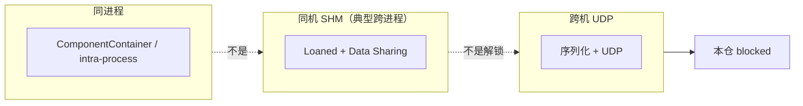

# 中日公开 ROS 2 / DDS 优化吸收（对照本仓双链）

Status: **文档对照 — 不落地旋钮。**  
查阅日期：2026-09-12。只写能核对到公开 URL 的内容；核不到的标 **未核实**，不编造数字。

三条「吸收」只进**本文**：奥比中光 Fast DDS 大缓冲、Autoware Cyclone 10MB recv window、Loaned Messages + Fast DDS Data Sharing。它们的数字与旋钮**不写进** [`config/fastdds.xml`](../../config/fastdds.xml)、SCOREBOARD 已记账表、SCOREBOARD current best、或任何现网 / 默认 XML。本仓不另写 Cyclone 示例文件。

| 允许 | 禁止（本 PR） |
|------|----------------|
| 本文 + README 一条指针 | 改 [`config/fastdds.xml`](../../config/fastdds.xml)（iter7 种子不动） |
| CI 检查本文存在 | 改 SCOREBOARD 已记账表 / current best |
| | 任何现网 / 默认 XML 写入新旋钮值 |
| | vendor Autoware / Agnocast / Isaac / zenoh / iceoryx |
| | 新增 RMW、rebase 发行版 |
| | Promptfoo / Mac 占位测 / CVE（《3》–《6》仍 **Hold**） |

**不是** 飞书现场 / 实机 / 跨机根因证明。Not Feishu field proof.

本仓契约仍是两条独立栈：[R0 接口冻结](ros2-dds-r0-interface-freeze.md)。链 A Fast-DDS 域 **42**，链 B Cyclone 域 **0**。DimOS 默认传输仍是 **LCM**（Linux）。NITROS 仍是同进程 GPU：[nitros-vs-dual-chain.md](nitros-vs-dual-chain.md)。跨机 UDP 仍 **blocked**（单机 yixin Docker DOWN）。

---

## 0. 拓扑先分清（零拷不是跨机解锁）

| 路径 | 是什么 | 不是什么 |
|------|--------|----------|
| **同进程** 零拷 / 少拷 | ComponentContainer / Fast DDS intra-process；节点在同一进程里，避开序列化/拷贝 | 不是跨进程，不是跨机 |
| **同机 SHM**（典型跨进程） | Fast DDS **Data Sharing** + ROS 2 **Loaned Messages**：同一台机器上共享 DataWriter history；Humble+ `rmw_fastrtps_cpp` 对 POD | **不是** 跨机 UDP 解锁。对端不在同一块共享内存时仍要序列化 |
| **跨机 UDP** | 普通 RMW/DDS 序列化走网卡 | 本仓仍 **STATUS: blocked**（yixin Docker DOWN / 单 VM）。无假分位数 |

本 PR **不**在现网 XML 翻转 `data_sharing`。

---

## 1. 对照到本仓双链

| 公开项 | 本仓落点 | 本 PR 动作 |
|--------|----------|------------|
| TIER IV / Autoware Agnocast（未定长真零拷；kmod + `LD_PRELOAD` heaphook；`ENABLE_AGNOCAST`） | **不是** 第三条链，也不是 RMW。跨机 / rviz / rosbag 仍走现有 RMW/DDS | **Hold**：不 vendor、不装 kmod |
| Autoware CycloneDDS 10MB recv window 等（见原文） | 链 B 默认 **不** 设 `CYCLONEDDS_URI` | **只引 URL**；不写示例 XML、不改默认 |
| Autoware 经典 ComponentContainer 同进程 | 同进程少拷；故障隔离 vs 零拷 | 只对照 |
| 奥比中光相机 Fast DDS 大缓冲（见原文） | 链 A 现网仍是 iter7 种子（iter2 已用 2MiB socket、builtin 开） | **只引 URL**；不回退、不改 XML |
| Fast DDS Data Sharing + Loaned Messages | 同机 SHM（典型跨进程）；跨机仍序列化 | **只对照**；不翻转现网 `data_sharing` |
| openEuler 24.03：Jazzy + `rmw_zenoh` 预览；Embedded Humble / SDK | 本仓 Humble + 双链 RMW；`ZenohTransport` 仍是空 stub | **Hold** 新 RMW 与 rebase |

---

## 2. 日本

### 2.1 Agnocast（TIER IV / Autoware）— Hold

公开博客：[Agnocast: A True Zero-Copy Publish/Subscribe IPC](https://autoware.org/agnocast-a-true-zero-copy-publish-subscribe-ipc/)（2025-09-24）。仓库：[tier4/agnocast](https://github.com/tier4/agnocast)（README 现指向 [autowarefoundation/agnocast](https://github.com/autowarefoundation/agnocast) 与 [Getting Started](https://autowarefoundation.github.io/agnocast_doc/environment-setup/)）。

已核实要点：

- Autoware 作为 ROS 2 应用，跨进程 pub/sub 会做多次拷贝（含序列化 / 反序列化）。他们曾用 **ComponentContainer 把节点放进同一进程** 来避开这份开销。从故障隔离看，更希望每节点独立进程，因此需要「对任意 ROS 2 消息（含 `std::vector` 等未定长类型）的真零拷 IPC」。
- Iceoryx / Iceoryx2 等生产级中间件支持真零拷，但**只覆盖静态尺寸消息**，Autoware 大量未定长类型用不了。TZC / LOT 也不是任意 ROS 2 消息。
- Agnocast：内核模块（`agnocast-kmod`，`sudo modprobe agnocast`）+ `LD_PRELOAD` heaphook（`agnocast-heaphook`）把堆分配拦到可跨进程映射的共享虚址；智能指针元数据在 kmod 里。博客写明与 ROS 2 栈**共存**，且「不受 RMW 实现变更影响」——它**不是**一个新 RMW。
- 源码侧还要改智能指针 / pub/sub 命名空间（`rclcpp` → `agnocast`）以及 launch（`LD_PRELOAD`、ComposableNode 用 Agnocast executor）。
- Autoware 集成用构建期环境变量 **`ENABLE_AGNOCAST`** 开关（博客指向 `autoware_agnocast_wrapper`）。wrapper 说明：未设或 `0` = 普通 ROS 2；`1` = Agnocast 构建。[review guide](https://github.com/autowarefoundation/autoware_core/blob/a50ac9281442b83ec240aedcb4fe78598e07c8e3/common/autoware_agnocast_wrapper/docs/review_guide.md)
- TIER IV 在 Open Robotics Discourse 写明：即使 Agnocast 构建，**跨主机通信以及依赖 RMW 的 rviz / rosbag 仍走现有 RMW 栈**；与非 Agnocast 节点靠 Bridge。[Discourse #52678](https://discourse.openrobotics.org/t/agnocast-callback-isolated-executor-true-zero-copy-ipc-and-middleware-transparent-scheduling-for-ros-2/52678)

**本仓 verdict: Hold。** 不 vendor Agnocast 树，不装 / 不加载 kmod，不加第三条链。跨机 UDP、域 42/0、Fast-DDS XML 旋钮都不在 Agnocast 覆盖范围。

### 2.2 Autoware CycloneDDS 配方 — 只引原文，不落地

来源（请直接读旋钮，不要抄进本仓 XML）：[DDS settings for ROS 2 and Autoware](https://autowarefoundation.github.io/autoware-documentation/main/installation/additional-settings-for-developers/network-configuration/dds-settings/)（与 [源码页](https://raw.githubusercontent.com/autowarefoundation/autoware-documentation/main/docs/installation/additional-settings-for-developers/network-configuration/dds-settings.md) 核对；站点 HTML 本次抓取曾 409，内容以该 markdown 为准）。

已核实（原文如此；**不**写入本仓默认 / 现网 / SCOREBOARD）：

- **CycloneDDS 是 Autoware 推荐且测得最多的 DDS。**
- 文档给出 `CYCLONEDDS_URI` 指向一份 XML，其中含 `SocketReceiveBufferSize` min 10MB、`MaxMessageSize` 65500B、`ParticipantIndex` none，以及他们的本机 `lo` 示例。Jazzy 上默认 participant index 大约 32，多节点会 `Failed to find a free participant index for domain 0`。
- 环境：`RMW_IMPLEMENTATION=rmw_cyclonedds_cpp`，`CYCLONEDDS_URI=file://…`。
- 系统侧另有 `net.core.rmem_max` / IP 分片调参（与 ROS 2 DDS tuning 同源）。**本仓不把这些写成已测根因，也不改现网。**

本仓映射：链 B 是 Cyclone / 域 **0**。[`config/env/chain_b.sh`](../../config/env/chain_b.sh) **默认不设** `CYCLONEDDS_URI`。本 PR **不**新增 Cyclone XML。要看 10MB recv window，去上面的 Autoware URL，不要从本仓抄一份当默认。

### 2.3 ComponentContainer 同进程 — 对照，不落地

同一篇 Agnocast 博客：Autoware 经典做法是 **ComponentContainer 同进程**，避免跨进程序列化/拷贝；Agnocast 存在，是因为他们要 **进程隔离 + 真零拷**。

**同进程零拷 = ComponentContainer / intra-process**，不是 Data Sharing，也不是跨机 UDP。这与本仓 [NITROS 对照](nitros-vs-dual-chain.md) 同一类权衡。same-process bench 只作诚实对照，**不要为它调参**。

---

## 3. 中国大陆

### 3.1 奥比中光相机 Fast DDS — 只引原文，勿改现网 XML

来源（请直接读缓冲与 transport，不要抄进 `fastdds.xml`）：[针对 Orbbec 相机与 ROS2 的 Fast DDS 优化](https://orbbec.github.io/OrbbecSDK_ROS2/zh/source/camera_devices/5_advanced_guide/performance/fastdds_tuning.html)。

已核实环境变量（原文）：`RMW_IMPLEMENTATION=rmw_fastrtps_cpp`、`FASTRTPS_DEFAULT_PROFILES_FILE`、`RMW_FASTRTPS_USE_QOS_FROM_XML=1`。

已核实他们的示例 XML（原文 `shm_fastdds.xml`）：UDP send/recv **1MiB**；`useBuiltinTransports` false（只用自定义 UDPv4）；另有 `maxMessageSize`、`initialPeersList` 127.0.0.1、以及 reader 侧 `data_sharing` AUTOMATIC 等。系统 `rmem_*` / IP 分片页上也有示例。

本仓链 A 现网仍是 **iter7 种子**：iter2 已把默认 participant UDP socket 提到 **2MiB**，且 **builtin UDP+SHM 开着**。**不要为对齐 Orbbec 页把 socket 回退到 1MiB，也不要关掉 builtin，也不要把他们的 1MiB / `useBuiltinTransports` false 写进本仓 XML。** 他们设 `RMW_FASTRTPS_USE_QOS_FROM_XML=1` 才会吃 writer/reader QoS；本仓 iter7 种子没有默认 writer/reader profile。

### 3.2 Fast DDS Data Sharing + Loaned Messages — 同机 SHM，不是跨机解锁

来源：

- eProsima：[ROS 2 using Fast DDS middleware](https://fast-dds.docs.eprosima.com/en/latest/fastdds/ros2/ros2.html)（`rmw_fastrtps_cpp` 为除 EOL Galactic 外的默认 RMW）
- eProsima：[Data-sharing delivery](https://fast-dds.docs.eprosima.com/en/latest/fastdds/transport/datasharing.html)（**同机**共享 DataWriter history；跨机仍走传输层）
- ROS 2 设计：[Zero Copy via Loaned Messages](https://design.ros2.org/articles/zero_copy.html)
- `rmw_fastrtps` README（本仓拷贝 [`vendor/rmw_fastrtps/README.md`](../../vendor/rmw_fastrtps/README.md) 与 [上游](https://github.com/ros2/rmw_fastrtps) 一致）：Humble 上 Loaned Messages 需要 **POD + 打开 Data Sharing**；Iron+ 只需 POD。打开 Data Sharing 要 XML `data_sharing` AUTOMATIC 且 `RMW_FASTRTPS_USE_QOS_FROM_XML=1`。默认 `rmw_fastrtps_cpp` 用 **SHM 做同机、UDPv4 做跨机**。

已核实约束（Data-sharing 页）：两端能碰同一块共享内存；类型 **bounded**；非 keyed；writer 预分配内存策略；不用 security。跨主机没有这块共享内存，仍要序列化走 UDP。

因此：

- **Loaned + Data Sharing = 同机 SHM，典型是跨进程**（两个 `ros2 run` / 两个 container 同 host）。
- **不是** 跨机 UDP 解锁。本仓跨机仍 **blocked**（yixin Docker DOWN）。
- **不是** 同进程 ComponentContainer / intra-process（那是另一条路径，见 §0 / §2.3）。
- **本 PR 不**在 [`config/fastdds.xml`](../../config/fastdds.xml) 加或翻转 `data_sharing`，也不设 `RMW_FASTRTPS_USE_QOS_FROM_XML`。SCOREBOARD 已把该家族标成「不是一个 XML 旋钮」——本文不改那一行。

### 3.3 openEuler 24.03 / Embedded — Hold 新 RMW 与 rebase

来源：

- [openEuler 社区 2025 年 3 月运作报告](https://www.openeuler.org/zh/news/openEuler/20250407-yb/20250407-yb.html)：openEuler **24.03 LTS** 引入 **ROS 2 Jazzy**（Turtlesim / rqt / 全套 CLI；移植工具 ROT）。文内写 Jazzy「首次引入 **rmw_zenoh 中间件预览版**」。
- [openEuler Embedded 24.03 — 嵌入式 ROS 运行时支持](https://embedded.pages.openeuler.org/openEuler-24.03-LTS/features/ros.html)：ROS2 镜像 / **快速开发 SDK**（`populate_sdk` + colcon 交叉编译）。同页写明「当前 src-openeuler 已集成 **ROS humble** 的所有软件源码」。

**本仓 verdict: Hold。** 不引入 `rmw_zenoh`（DimOS `ZenohTransport` 仍是空 stub）。不把发行版从 Humble rebase 到 Jazzy。Embedded SDK 只作公开存在证明，不 vendor、不改 Docker 配方。

---

## 4. 对本仓契约的明确「不是」

| 项 | 状态 |
|----|------|
| 链 A：`rmw_fastrtps_cpp` / 域 42 / `config/fastdds.xml` iter7 种子 | **不变** |
| 链 B：Cyclone / 域 0；默认不设 `CYCLONEDDS_URI` | **不变**；Autoware 配方只引 URL |
| DimOS 默认 LCM | **不变**，仍在 DDS 范围外 |
| NITROS | 仍同进程 GPU only，见 [nitros-vs-dual-chain.md](nitros-vs-dual-chain.md) |
| Loaned + Data Sharing | 同机 SHM（典型跨进程）；**不是**跨机 UDP |
| 同进程零拷 | ComponentContainer / intra-process；**不是** Data Sharing |
| 跨机 UDP | 仍 **STATUS: blocked**（yixin Docker DOWN / 单 VM）；无假分位数 |
| 现网 `data_sharing` | **不翻转** |
| 《3》90%/LLM、《4》Mac/preprod、《5》Promptfoo、《6》CVE | 仍 **Hold** |
| 飞书现场 / 实机根因 | **不是。** Not Feishu field proof. |

---

## 5. 公开引用

只列本文用过的链接（2026-09-12 核对）：

1. Autoware — *Agnocast: A True Zero-Copy Publish/Subscribe IPC*：<https://autoware.org/agnocast-a-true-zero-copy-publish-subscribe-ipc/>
2. GitHub `tier4/agnocast`：<https://github.com/tier4/agnocast>（README 现指向 AWF 树 / 文档站）
3. AWF Agnocast Getting Started：<https://autowarefoundation.github.io/agnocast_doc/environment-setup/>
4. Open Robotics Discourse #52678（跨机 / rviz / rosbag 仍走 RMW）：<https://discourse.openrobotics.org/t/agnocast-callback-isolated-executor-true-zero-copy-ipc-and-middleware-transparent-scheduling-for-ros-2/52678>
5. `autoware_agnocast_wrapper` review guide（`ENABLE_AGNOCAST`）：<https://github.com/autowarefoundation/autoware_core/blob/a50ac9281442b83ec240aedcb4fe78598e07c8e3/common/autoware_agnocast_wrapper/docs/review_guide.md>
6. Autoware Documentation — *DDS settings*（Cyclone 10MB recv 等，只引不抄）：<https://autowarefoundation.github.io/autoware-documentation/main/installation/additional-settings-for-developers/network-configuration/dds-settings/>
7. OrbbecSDK ROS2 — Fast DDS 优化（大缓冲，只引不抄）：<https://orbbec.github.io/OrbbecSDK_ROS2/zh/source/camera_devices/5_advanced_guide/performance/fastdds_tuning.html>
8. eProsima Fast DDS — ROS 2：<https://fast-dds.docs.eprosima.com/en/latest/fastdds/ros2/ros2.html>
9. eProsima Fast DDS — Data-sharing delivery：<https://fast-dds.docs.eprosima.com/en/latest/fastdds/transport/datasharing.html>
10. ROS 2 design — *Zero Copy via Loaned Messages*：<https://design.ros2.org/articles/zero_copy.html>
11. `ros2/rmw_fastrtps` README：<https://github.com/ros2/rmw_fastrtps>
12. openEuler 2025-03 月报（Jazzy + `rmw_zenoh` 预览）：<https://www.openeuler.org/zh/news/openEuler/20250407-yb/20250407-yb.html>
13. openEuler Embedded 24.03 — 嵌入式 ROS（Humble 源码 + SDK）：<https://embedded.pages.openeuler.org/openEuler-24.03-LTS/features/ros.html>
14. 本仓双链：[ros2-dds-r0-interface-freeze.md](ros2-dds-r0-interface-freeze.md) · [nitros-vs-dual-chain.md](nitros-vs-dual-chain.md)
