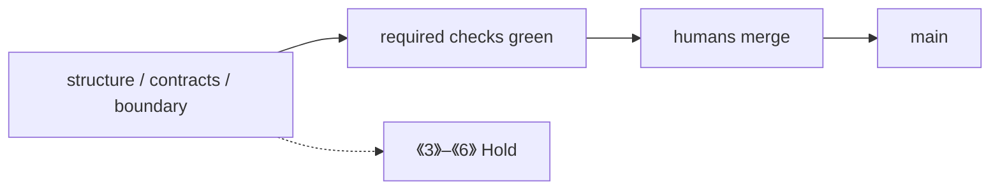

# 飞书 wiki3 §13(6) CI + 灰度（CI + gray process gate）

Status: **process gate** — `STATUS: process gate`。本切只把「CI + 灰度」写成可核对的过程闸；不是已扩 CI 到 Mac HIL / Promptfoo / CVE / 90% LLM，不是飞书现场，不是跨机根因。  
查阅日期：2026-09-12。对照飞书《ROS 2 源码闭环》<https://topsunhzj.feishu.cn/wiki/N0Xaw1vsdiXRD4km9Jvc8kHynBf> §13 第 (6) 步（**CI + 灰度** / **CI + gray**）。另两份飞书计划（已在 ADR）：《通信中间件》<https://topsunhzj.feishu.cn/wiki/XKDbw7blLieO4ykCRgLcUCJKnXe>、Cyclone 工业级 fork 研究 <https://topsunhzj.feishu.cn/docx/SrokdQU4DovvdAxutNDcXByMn5e>。

本环境打不开飞书 wiki 正文（登录墙 / 抓取失败）。本页章节对照**派生自**已合入 ADR [feishu-middleware-adr.md](feishu-middleware-adr.md) §2 第 (6) 行、[ci-cd-gates.md](ci-cd-gates.md)（三个 required job、人类 merge、不自动合入）；**不是** live Feishu excerpt，不阻塞等 wiki。双链契约：[ros2-dds-r0-interface-freeze.md](ros2-dds-r0-interface-freeze.md)。CI 闸门权威页：[ci-cd-gates.md](ci-cd-gates.md)。

**不是** 飞书现场 / 实机 / 跨机根因证明。Not Feishu field proof.

本切只落地文档 + 证明脚本 + CI 登记。**no XML/SCOREBOARD this cut.** **no vendor compile** in CI。不捆绑 Cega+memory+XML。

---

## 0. 硬规则

1. **`STATUS: process gate`。** 飞书 §13(6) 是过程规则，不是已把灰度扩成 Mac HIL / Promptfoo / CVE / 90% LLM。三个 required job 名不变：`structure` / `contracts` / `boundary`。
2. **gray = required checks green + humans merge + no auto-merge。** 灰度在本仓 = 三个 required job 绿 + **humans merge** + **no auto-merge**。**不是** Mac HIL / Promptfoo / CVE / 90% LLM（那些仍 Hold）。
3. **humans merge；agents stop before merge/production。** Agent 可以开 PR、推提交、等 CI、修红，停在 merge / production 闸门之前。人类批准 merge。本仓不自动合入。
4. **no vendor compile。** CI **不**编译 vendor（Fast-DDS / Cyclone / RMW 树）。`structure` 只核对路径与证明脚本；`contracts` 只核 env / 链接 / `prove_rmw.py`（无 ROS）；`boundary` 只冻 XML / SCOREBOARD / Agnocast·zenoh **路径**。
5. **XML / SCOREBOARD 冻结。** [`config/fastdds.xml`](../../config/fastdds.xml) 与 [`docs/artifacts/bench/SCOREBOARD.md`](../artifacts/bench/SCOREBOARD.md) 内容冻结。默认 **no XML/SCOREBOARD this cut**。只有人类贴 **`allow-hold-bypass`** 才能动这两份；Agent 不得自己贴。
6. **#41 与 #42 may still be open — do not claim they merged。** PR [#41](https://github.com/topsun-bot/ros2_hzj/pull/41)（memory sink Hold）与 [#42](https://github.com/topsun-bot/ros2_hzj/pull/42)（§13(5) one-layer process gate）可能仍开着。本切不 rebase 到它们，不改它们的分支，不宣称已合入。
7. **《3》–《6》仍 Hold。** 《3》90%/LLM、《4》Mac/preprod、《5》Promptfoo、《6》CVE 仍出范围。跨机 UDP 仍 **cross-host blocked**（单机 / yixin Docker DOWN）。无假分位数。
8. **不启用 Agnocast / zenoh。** 亦不接 eCAL / DPDK / Isaac / 自定义 RMW。不改 `dimos_bridge` 运行时、不改 vendor 源码。不捆绑 Cega+memory+XML。

核对本页过程闸标记仍在：[`scripts/check_ci_gray.py`](../../scripts/check_ci_gray.py)。

---

## 1. 本切是什么 / 不是什么

| 是 | 不是 |
|----|------|
| 文档 + `check_ci_gray.py` + CI `structure` 登记 | 已扩 CI 到 Mac HIL / Promptfoo / CVE / 90% LLM |
| 把 ADR §13(6)「三个 required job + 不编译 vendor」写成可失败的标记 | 飞书现场、实机、跨机根因 |
| 指向已有 [ci-cd-gates.md](ci-cd-gates.md)：`structure` / `contracts` / `boundary` | 改三个 job 名，或加第四个 required job |
| gray = required checks green + humans merge + no auto-merge | 自动合入、Agent merge、生产发布 |
| 本切 **no XML/SCOREBOARD this cut**；**no vendor compile** | 调 `fastdds.xml`、改 SCOREBOARD 数字、编 vendor |
| 声明 #41 / #42 may still be open | 宣称 #41 / #42 已合入 |

Agent **stop before merge/production**。人类 merge。

---

## 2. 灰度在本仓的落点（不是新流水线）

飞书 §13(6) 写 **CI + 灰度**。本环境未取到 wiki 正文；本仓按已合入 ADR + [ci-cd-gates.md](ci-cd-gates.md) 落地，不发明飞书字段号。



| 词 | 本仓含义 | 权威页 |
|----|----------|--------|
| **CI** | 三个 required job 名不变：`structure` / `contracts` / `boundary`。路径 + 相对链接 + 现网检查器。**no vendor compile** | [ci-cd-gates.md](ci-cd-gates.md) §1；工作流 [`.github/workflows/ci.yml`](../../.github/workflows/ci.yml) |
| **灰度 / gray** | **required checks green + humans merge + no auto-merge** | [ci-cd-gates.md](ci-cd-gates.md) §5 Branch protection |
| **不是灰度** | Mac HIL / Promptfoo / CVE / 90% LLM | [ci-cd-gates.md](ci-cd-gates.md) §1「本阶段不做」；仍 **Hold** |
| **跨机** | UDP 仍 **cross-host blocked** | [latency-attribution.md](latency-attribution.md)；bench `2026-09-11-cross-host` |

**禁止：** 把本页写成「灰度 = Mac HIL 已跑」或「可以 auto-merge」。  
**禁止：** 为了绿去编译 vendor，或改三个 job 名。  
**禁止：** 同一 PR 捆绑 Cega+memory+XML + 本闸。

---

## 3. 闸门怎么跑

```bash
python3 scripts/check_ci_gray.py
```

无 ROS 时应 exit 0，并打印 `§13(6) CI + gray: process gate`。脚本打开这些文件：

| 打开 | 断言 |
|------|------|
| 本文 [`feishu-ci-gray.md`](feishu-ci-gray.md) | `STATUS: process gate`、`§13(6)` / `CI + 灰度` / `CI + gray`、`structure` / `contracts` / `boundary`、`humans merge` / `no auto-merge` / `agents stop before merge/production`、`no vendor compile`、`no XML/SCOREBOARD this cut`、`《3》`–`《6》`、`cross-host blocked`、#41 / #42 may still be open / do not claim they merged、`派生自`、`Not Feishu field proof`、gray = required checks green + humans merge + no auto-merge（不是 Mac HIL / Promptfoo / CVE / 90% LLM） |
| [feishu-middleware-adr.md](feishu-middleware-adr.md) | 第 (6) 行仍写 process gate + 三个 job 名 + `feishu-ci-gray.md` + 不编译 vendor |
| [ci-cd-gates.md](ci-cd-gates.md) | 三个 job 名仍在；人类 merge / 不自动合入仍在 |
| [`config/fastdds.xml`](../../config/fastdds.xml) | **只检查存在**。内容冻结由 CI **`boundary`** 管 |
| [`docs/artifacts/bench/SCOREBOARD.md`](../artifacts/bench/SCOREBOARD.md) | **只检查存在**。不读数字；内容冻结由 **`boundary`** 管 |

CI 登记见 [ci-cd-gates.md](ci-cd-gates.md)。**不要**为了本地绿去编译 vendor、接 Cega、改 XML / SCOREBOARD、或把 #41 / #42 合进本切。

---

## 4. 引用

飞书（查阅 2026-09-12；本环境未取到 wiki 正文，本仓按已合入 ADR / `ci-cd-gates.md` 落地）：

1. 《ROS 2 源码闭环》§13 (6) CI + 灰度：<https://topsunhzj.feishu.cn/wiki/N0Xaw1vsdiXRD4km9Jvc8kHynBf>
2. 《通信中间件》：<https://topsunhzj.feishu.cn/wiki/XKDbw7blLieO4ykCRgLcUCJKnXe>
3. Cyclone 工业级 fork 研究：<https://topsunhzj.feishu.cn/docx/SrokdQU4DovvdAxutNDcXByMn5e>

本仓：

4. [feishu-middleware-adr.md](feishu-middleware-adr.md) — §13(6) 派生源
5. [ci-cd-gates.md](ci-cd-gates.md) — 三个 required job、人类 merge、不自动合入、不编译 vendor（派生源）
6. [feishu-cega-bridge-hold.md](feishu-cega-bridge-hold.md) — §13(4) Cega / Bridge 仍 Hold
7. [latency-attribution.md](latency-attribution.md) — 跨机 UDP `cross-host blocked`
8. [scripts/check_ci_gray.py](../../scripts/check_ci_gray.py)
