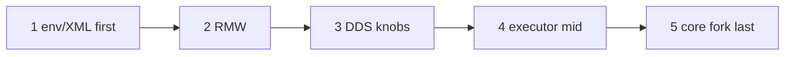

# 飞书 wiki3 §13(5) 一次一层（one-layer process gate）

Status: **process gate** — `STATUS: process gate`。本切只把「一次一层」写成可核对的过程闸；不是已改中间件、不是飞书现场、不是跨机根因。  
查阅日期：2026-09-12。对照飞书《ROS 2 源码闭环》<https://topsunhzj.feishu.cn/wiki/N0Xaw1vsdiXRD4km9Jvc8kHynBf> §13 第 (5) 步（**一次一层** / **one-layer**）。另两份飞书计划（已在 ADR）：《通信中间件》<https://topsunhzj.feishu.cn/wiki/XKDbw7blLieO4ykCRgLcUCJKnXe>、Cyclone 工业级 fork 研究 <https://topsunhzj.feishu.cn/docx/SrokdQU4DovvdAxutNDcXByMn5e>。

本环境打不开飞书 wiki 正文（登录墙 / 抓取失败）。本页章节对照**派生自**已合入 ADR [feishu-middleware-adr.md](feishu-middleware-adr.md) §2 第 (5) 行、§9.4 层序、[feishu-sink-layers.md](feishu-sink-layers.md)、[feishu-risk-matrix.md](feishu-risk-matrix.md)；**不是** live Feishu excerpt，不阻塞等 wiki。双链契约：[ros2-dds-r0-interface-freeze.md](ros2-dds-r0-interface-freeze.md)。下沉面清单已在：[feishu-sink-layers.md](feishu-sink-layers.md)。层序：[feishu-risk-matrix.md](feishu-risk-matrix.md)。CI 闸门：[ci-cd-gates.md](ci-cd-gates.md)。

**不是** 飞书现场 / 实机 / 跨机根因证明。Not Feishu field proof.

本切只落地文档 + 证明脚本 + CI 登记。**no XML/SCOREBOARD this cut.** 下一层另开 PR（**separate PR**）。不捆绑 Cega+memory+XML。

---

## 0. 硬规则

1. **`STATUS: process gate`。** 飞书 §13(5) 是过程规则，不是某一层已经落地。下沉面（app / rcl / rmw / DDS / executor / memory）已经拆在 [feishu-sink-layers.md](feishu-sink-layers.md)。本页只把「一次一层」收成 CI 可核对的闸。
2. **一个飞书 / 中间件层 = 一个 PR。** one Feishu/middleware layer per PR。下一层另开 PR。本切不落地 memory、不接 Cega、不改 XML。
3. **XML / SCOREBOARD 冻结，除非带标签。** [`config/fastdds.xml`](../../config/fastdds.xml) 与 [`docs/artifacts/bench/SCOREBOARD.md`](../artifacts/bench/SCOREBOARD.md) 内容冻结（`XML/SCOREBOARD frozen unless labeled`）。默认 **no XML/SCOREBOARD this cut**。只有人类贴 **`allow-hold-bypass`** 才能动这两份；Agent 不得自己贴。
4. **禁止捆绑 Cega+memory+XML。** 不得把 §13(4) Cega、memory 下沉、与 XML / SCOREBOARD 改写塞进同一 PR。Cega 仍 Hold：[feishu-cega-bridge-hold.md](feishu-cega-bridge-hold.md)。
5. **层序指针（不重判）。** §9.4 / sink-layers 顺序仍是：**env/XML first**，**executor mid**，**core fork last**。权威页：[feishu-risk-matrix.md](feishu-risk-matrix.md)（env/XML 第一优先 → RMW → DDS knobs → Executor/memory 居中 → core forks 最后）、[feishu-sink-layers.md](feishu-sink-layers.md)。本页不另发明层序。
6. **#41 memory Hold may still be open — do not claim it merged。** PR [#41](https://github.com/topsun-bot/ros2_hzj/pull/41)（memory sink Hold）可能仍开着。本切不 rebase 到 #41，不改它的分支，不宣称 memory Hold 已合入。
7. **《3》–《6》仍 Hold。** 《3》90%/LLM、《4》Mac/preprod、《5》Promptfoo、《6》CVE 仍出范围。跨机 UDP 仍 **cross-host blocked**（单机 / yixin Docker DOWN）。无假分位数。
8. **不启用 Agnocast / zenoh。** 亦不接 eCAL / DPDK / Isaac / 自定义 RMW。不改 `dimos_bridge` 运行时、不改 vendor 源码。

核对本页过程闸标记仍在：[`scripts/check_one_layer.py`](../../scripts/check_one_layer.py)。

---

## 1. 本切是什么 / 不是什么

| 是 | 不是 |
|----|------|
| 文档 + `check_one_layer.py` + CI `structure` 登记 | 已改 RMW / DDS / Executor / memory |
| 把 ADR §13(5)「一次一层 / 下一层另开 PR」写成可失败的标记 | 飞书现场、实机、跨机根因 |
| 指向已有 sink-layers / risk-matrix 层序 | 再拆一套层表，或把地图写成 PASS |
| 本切 **no XML/SCOREBOARD this cut** | 调 `fastdds.xml`、改 SCOREBOARD 数字 |
| 声明 #41 may still be open | 宣称 #41 已合入 / memory Hold 已落地 |

下一层（例如 memory Hold、或以后某层的实改）必须 **separate PR**。不要把过程闸与那一层捆在一起合。

---

## 2. 层序指针（sink-layers / risk-matrix）

飞书要差异化下沉，但**一次只动一层，且按顺序**：



| 顺序 | 层 | 权威页 | 本切 |
|------|----|--------|------|
| 1 | **env/XML first** | [feishu-risk-matrix.md](feishu-risk-matrix.md) §1；链 A [`config/fastdds.xml`](../../config/fastdds.xml) 只读 | **不改。** 内容冻结除非 `allow-hold-bypass` |
| 2 | RMW | [feishu-sink-layers.md](feishu-sink-layers.md) **rmw** 行；[`prove_rmw.py`](../../scripts/prove_rmw.py) | 不发明自定义 RMW |
| 3 | DDS knobs | sink-layers **DDS** 行；SCOREBOARD **pointer** | 不重写 XML、不记账 |
| 4 | **executor mid** / memory | sink-layers **executor** / **memory**；[feishu-executor-waitset.md](feishu-executor-waitset.md) | 身份地图已在。memory Hold = #41，**may still be open** |
| 5 | **core fork last** | risk-matrix core forks；本仓无 vendor `rcl` / `rclcpp` | **最后。** 本切不做 |

**禁止：** 跳过 env/XML 直接改 RMW / DDS 核心。  
**禁止：** 同一 PR 捆绑 Cega+memory+XML。  
**禁止：** 把本页写成「memory 已合入」或「可以自研 RMW」。

---

## 3. 闸门怎么跑

```bash
python3 scripts/check_one_layer.py
```

无 ROS 时应 exit 0，并打印 `§13(5) one-layer: process gate`。脚本打开这些文件：

| 打开 | 断言 |
|------|------|
| 本文 [`feishu-one-layer.md`](feishu-one-layer.md) | `STATUS: process gate`、`one-layer` / `一次一层`、`separate PR` / `下一层另开 PR`、`no XML/SCOREBOARD this cut`、`Cega+memory+XML`、`《3》`–`《6》`、`cross-host blocked`、#41 may still be open / do not claim it merged、`派生自`、env/XML first · executor mid · core fork last |
| [feishu-middleware-adr.md](feishu-middleware-adr.md) | 第 (5) 行仍写 process gate + 下一层另开 PR + `feishu-one-layer.md` |
| [feishu-sink-layers.md](feishu-sink-layers.md) | 层序指针目标仍在（`一次一层` + 六层） |
| [feishu-risk-matrix.md](feishu-risk-matrix.md) | 层序指针目标仍在（`env/XML` + `core forks`） |
| [`config/fastdds.xml`](../../config/fastdds.xml) | **只检查存在**。内容冻结由 CI **`boundary`** 管 |
| [`docs/artifacts/bench/SCOREBOARD.md`](../artifacts/bench/SCOREBOARD.md) | **只检查存在**。不读数字；内容冻结由 **`boundary`** 管 |

CI 登记见 [ci-cd-gates.md](ci-cd-gates.md)。**不要**为了本地绿去编译 vendor、接 Cega、改 XML / SCOREBOARD、或把 #41 合进本切。

---

## 4. 引用

飞书（查阅 2026-09-12；本环境未取到 wiki 正文，本仓按已合入 ADR / sink-layers / risk-matrix 落地）：

1. 《ROS 2 源码闭环》§13 (5) 一次一层：<https://topsunhzj.feishu.cn/wiki/N0Xaw1vsdiXRD4km9Jvc8kHynBf>
2. 《通信中间件》：<https://topsunhzj.feishu.cn/wiki/XKDbw7blLieO4ykCRgLcUCJKnXe>
3. Cyclone 工业级 fork 研究：<https://topsunhzj.feishu.cn/docx/SrokdQU4DovvdAxutNDcXByMn5e>

本仓：

4. [feishu-middleware-adr.md](feishu-middleware-adr.md) — §13(5) 派生源
5. [feishu-sink-layers.md](feishu-sink-layers.md) — app / rcl / rmw / DDS / executor / memory（Hold vs allowed）
6. [feishu-risk-matrix.md](feishu-risk-matrix.md) — §9.4 层序（env/XML first → executor mid → core fork last）
7. [feishu-cega-bridge-hold.md](feishu-cega-bridge-hold.md) — §13(4) Cega / Bridge 仍 Hold
8. [feishu-executor-waitset.md](feishu-executor-waitset.md) · [ci-cd-gates.md](ci-cd-gates.md)
9. [scripts/check_one_layer.py](../../scripts/check_one_layer.py)
